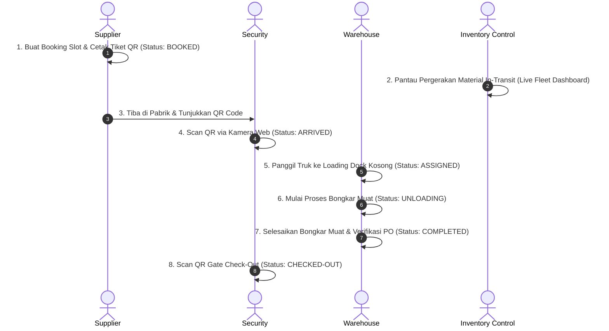

# LOGISLOT
### Integrated Time-Slot Booking & Real-Time Fleet Tracking Platform

[](https://nodejs.org/)
[](https://nextjs.org/)
[](https://expressjs.com/)
[](https://www.prisma.io/)
[](https://mariadb.org/)
[](#)

*Solusi Perangkat Lunak Manajemen Antrean Truk Bongkar Muat Gudang dan Pelacakan Armada Real-Time.*

---

## 1. Ringkasan Eksekutif (Executive Summary)

LOGISLOT adalah platform logistik enterprise yang dirancang khusus untuk memodernisasi dan mendigitalisasi operasional lalu lintas armada truk di area pabrik dan gudang (Warehouse Inbound Logistics). 

Sistem ini menghilangkan inefisiensi antrean fisik manual, mengeliminasi risiko bentrokan jadwal (double-booking), mempercepat proses pemeriksaan di gerbang utama (security gate check-in), serta menyajikan visibilitas status pergerakan armada dan material secara real-time kepada seluruh pemangku kepentingan.

### Key Performance Indicators (KPI) & Nilai Bisnis
* **Pengurangan Waktu Wait-Time**: Menurunkan waktu tunggu truk di area gerbang dan kantong parkir hingga >30%.
* **Durasi Gate Check-in Instant**: Proses verifikasi tiket via scanner QR Code kamera web selesai dalam < 3 detik.
* **Eliminasi Double Booking (0% Conflict)**: Penguncian transaksi tingkat Serializable Isolation menjamin kepastian kuota loading dock.
* **Transparansi Fleet In-Transit 100%**: Visibilitas penuh status pengiriman material untuk tim Inventory Control (IC) dan Gudang.

---

## 2. Matriks Peran Pengguna (User Roles & Access Control)

LogisSlot menerapkan Role-Based Access Control (RBAC) yang membagi pengguna ke dalam 5 peran operasional dengan kredensial pengujian (seed data) sebagai berikut:

| Peran (Role) | Email Login | Password Demo | Otoritas & Tanggung Jawab Operasional |
| :--- | :--- | :--- | :--- |
| **Supplier / Vendor** | `supplier@logislot.com` | `password123` | Memesan slot kedatangan truk (H-1 max 15:00 WIB), mengunduh Tiket QR Code, memantau status pesanan, serta mengelola pembatalan. |
| **Inventory Control (IC)** | `ic@logislot.com` | `password123` | Memantau daftar armada in-transit, memvalidasi kesesuaian dokumen PO, serta mengawasi SLA keterlambatan pemasok. |
| **Security (Pos Gerbang)** | `security@logislot.com` | `password123` | Memverifikasi fisik armada di pintu masuk (Check-in) dan keluar (Check-out) menggunakan scanner QR Code Web Camera interaktif. |
| **Warehouse (Gudang)** | `warehouse@logislot.com` | `password123` | Mengalokasikan truk dari antrean parkir ke Loading Dock (Dock A/B/C), serta mengontrol waktu mulai/selesai bongkar muat (Unloading). |
| **System Administrator** | `admin@logislot.com` | `password123` | Mengelola data induk (User, Loading Dock, Time Slot), konfigurasi batas toleransi, dan audit log riwayat aktivitas sistem. |

---

## 3. Alur Kerja & Lifecycle Armada (Armada Supply Chain Flow)

Seluruh tahapan pergerakan truk dicatat secara otomatis ke dalam Tracking Logs dengan stempel waktu (timestamp) akurat:



---

## 4. Aturan Bisnis Utama (Business Rules & Tolerance)

1. **Jendela Pemesanan Slot (Booking Cut-off)**:
   - Pemesanan slot kedatangan hanya dapat dilakukan maksimal pada **H-1 sebelum pukul 15:00 WIB**.
2. **Jendela Pembatalan / Reschedule**:
   - Pembatalan atau perubahan jadwal oleh Supplier diperbolehkan paling lambat **4 jam sebelum** jam slot dimulai.
3. **Toleransi Waktu Kedatangan (Gate Arrival Window)**:
   - **Tepat Waktu**: Kedatangan berada pada rentang **-30 menit hingga +30 menit** dari jam slot yang dipesan.
   - **Peringatan Toleransi**: Kedatangan di luar jendela toleransi (Terlalu Awal / Terlambat) memicu notifikasi khusus pada layar Security.
   - **Penolakan Tiket**: QR Code tidak valid, pernah digunakan, atau bukan jadwal hari ini.
4. **Proteksi Concurrency & Database Lock**:
   - Setiap transaksi pemesanan slot diproses menggunakan transaksi terisolasi (*Serializable Isolation Level*) untuk mencegah terjadinya race condition saat banyak pengguna mengakses kuota slot yang sama secara bersamaan.

---

## 5. Arsitektur Sistem & Tech Stack

Sistem LogisSlot dibangun menggunakan arsitektur **Client-Server Modern** berbasis RESTful API dan komunikasi real-time bi-directional via WebSocket.

```text
[ Client Application (Browser / Tablet / Mobile) ]
       │                        │
  (HTTPS / REST)          (WSS / WebSocket)
       │                        │
       ▼                        ▼
[ Reverse Proxy / Nginx (SSL Termination & Rate Limit) ]
       │
       ▼
[ Node.js / Express.js Backend Core Engine ]
       ├── Authentication (JWT & Bcrypt Hashing)
       ├── Business Logic & Validation Rules
       ├── WebSocket Gateway (Socket.io)
       └── Prisma ORM Client
               │
               ├──────────────────────┐
               ▼                      ▼
     [ MariaDB / PostgreSQL ]   [ Redis Cache ]
```

### Stack Teknologi
* **Frontend Framework**: [Next.js](https://nextjs.org/) (React 18) & TypeScript
* **Styling & UI**: Tailwind CSS, Lucide React Icons, Driver.js (Interactive Tour Guide)
* **Scanner Core**: `@html5-qrcode` & HTML5 Web Camera Stream Integration
* **Backend Framework**: Node.js & Express.js (ES Modules / TypeScript)
* **ORM & Database**: Prisma ORM & MariaDB / PostgreSQL
* **Real-time Engine**: Socket.io (WebSocket Server & Client broadcast)
* **API Documentation**: Swagger UI OpenAPI v3 (`/api-docs`)

---

## 6. Panduan Instalasi & Pengoperasian (Getting Started)

### Prasyarat Sistem (Prerequisites)
- **Node.js**: v18.0.0 atau versi lebih baru
- **NPM**: v9.0.0 atau versi lebih baru
- **Database Engine**: MariaDB / MySQL / PostgreSQL (misal via Laragon, XAMPP, atau Docker)

---

### Setup & Running Backend API
```bash
# 1. Pindah ke direktori backend
cd backend

# 2. Install dependensi modul
npm install

# 3. Konfigurasi file environment (Pastikan file .env telah disesuaikan)
# Contoh isi .env: DATABASE_URL="mysql://root:@localhost:3306/logislot"

# 4. Sinkronisasi skema database & Prisma Client
npx prisma db push

# 5. Jalankan Seeder Data Demo (Membuat Akun User, Dock A/B/C, Time Slots, & Sample Bookings)
npx prisma db seed

# 6. Jalankan server pengembang (Running on Port 5000)
npm run dev
```

> **Dokumentasi API Interactive**: Buka browser dan akses `http://localhost:5000/api-docs` saat backend berjalan.

---

### Setup & Running Frontend Web App
```bash
# 1. Pindah ke direktori frontend
cd frontend

# 2. Install dependensi modul
npm install

# 3. Jalankan aplikasi web pengembang (Running on Port 3000)
npm run dev
```

> **Akses Antarmuka Web**: Buka browser dan akses `http://localhost:3000/login`

---

## 7. Struktur Repositori & Dokumentasi Spesifikasi

Berikut adalah peta struktur berkas proyek beserta dokumen cetak biru (blueprint) pendukung:

```text
LogisSlot/
├── README.md              # Dokumentasi Utama Proyek (File ini)
├── PRD.md                 # Product Requirements Document & Business Goals
├── Architecture.md        # Spesifikasi Arsitektur & Network Flow
├── Schema.md              # Struktur & Relasi Skema Database (ERD)
├── Rules.md               # Aturan Bisnis, Toleransi SLA, & Kode Standar
├── USER_MANUAL.md         # Panduan Operasional SOP Lapangan (Security, Gudang, Supplier)
├── DEPLOYMENT.md          # Panduan Deployment Server, Nginx, & Docker
├── HANDOVER.md            # Checklist Kesiapan & Serah Terima Sistem
├── package.json           # Root Project Workspace Config
├── backend/               # Source Code Node.js Express API Server
│   ├── prisma/            # Schema definition (schema.prisma) & Seeder (seed.ts)
│   ├── src/               # Controllers, Services, Middlewares, & Routes
│   └── swagger.yaml       # Spesifikasi OpenAPI / Swagger
└── frontend/              # Source Code Next.js React Web Application
    ├── src/app/           # Next.js App Router (Page views & Layouts)
    └── src/components/    # Reusable UI Components & Modals
```

---

**LOGISLOT** — Streamlining Warehouse Logistics, Maximizing Fleet Throughput.
